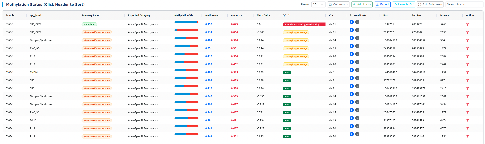

# GMS nallo Methylation Dashboard

[](https://github.com/GMS-CGL/gms-nallo-methylation-dashboard)
[](LICENSE)

A premium, web-based visualization dashboard for clinical methylation analysis, specifically designed for the **GMS nallo** pipeline. It provides an interactive interface to review phased methylation data, quality control metrics, and external genomic context (gnomAD/NCBI).

## 🌟 Key Features

- **Interactive Triage Table**: Sort, filter, and re-order columns to focus on critical regions.
- **Phased Visualization**: Deep integration with **IGV-Web** to visualize haplotagged BAM files and base modifications (5mC).
- **External Genomic Context**: One-click access to **gnomAD v4** and **NCBI Genome Data Viewer** for any locus.
- **Dynamic CRUD Operations**: Manually add, edit, or remove loci for clinical reporting.
- **Separate Sample Reports**: Automatically generates independent HTML reports for each sample in a run.
- **Performance Optimized**: Lazy-loading IGV viewer and instructions to ensure rapid initial dashboard loading.
- **Each sample report**: Individual sample report html, avoiding cluttering of multiple sample data in one html page.


## 🚀 Quick Start

### 1. Prerequisites
- **Python ≥ 3.7+**
- No external Python libraries required (uses built-in `json`, `csv`, `pathlib`).

### 2. Clone the git repository

```bash
git clone https://github.com/JD2112/gms-nallo-methylation-dashboard.git
cd gms-nallo-methylation-dashboard
```

### 3. Run the Manager
Point the manager to your `gms-nallo` results directory:

```bash
python3 scripts/nallo_methylation_manager.py \
    --results <PATH/TO/GMS-nallo results> \
    --template ./templates/dashboard-template.html \
    --output ./results/reports/
```

### 4. Open the Report
Navigate to your output directory and open the generated HTML file in any modern browser:
```bash
open <PATH/TO/reports/SAMPLE_ID_methylation_report.html>
```

## 📂 Project Structure

```text
├── scripts/
│   └── nallo_methylation_manager.py  # Main report generator
├── templates/
│   └── dashboard-template.html       # Interactive HTML/JS template
├── docs/                             # MkDocs documentation
└── results/                          # Generated reports and tables
```



## 🛠️ Integrated Tools

| Tool | Purpose |
| :--- | :--- |
| **AG-Grid** | High-performance interactive data table |
| **IGV-Web** | Integrated Genome Viewer for phased reads |
| **Chart.js** | Dynamic statistics and distribution charts |
| **gnomAD** | Population frequency and variant context |
| **NCBI GDV** | Comparative genomic visualization |

## 👥 Authors & Maintainers

- **[Jyotirmoy Das](https://github.com/JD2112)** - *Lead Developer* - Bionformatics Core Facility, Linköping University & Clinical Genomics Linköping

## 📜 License

This project is licensed under the MIT License - see the [LICENSE](LICENSE) file for details.
